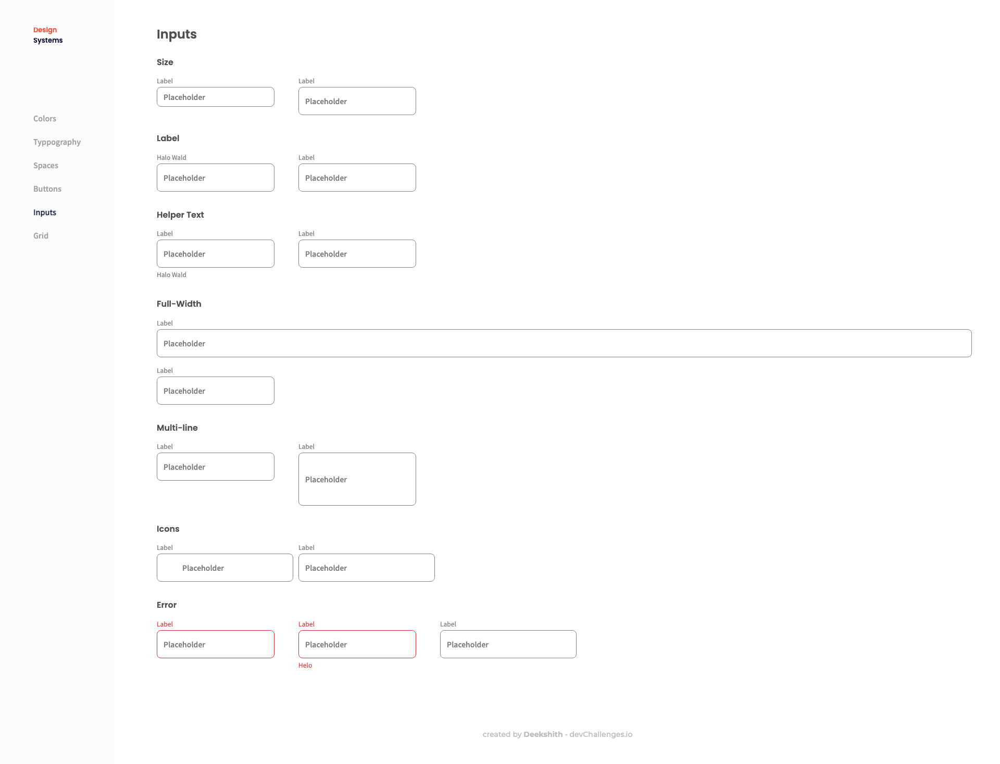
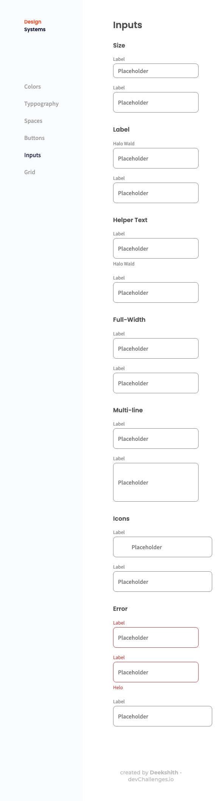

<!-- Please update value in the {}  -->

<h1 align="center">Input Design System</h1>

<div align="center">
   Solution for a challenge from  <a href="http://devchallenges.io" target="_blank">Devchallenges.io</a>.
</div>

<div align="center">
  <h3>
    <a href="https://devchallenges-fed-2.onrender.com">
      Demo
    </a>
    <span> | </span>
    <a href="https://github.com/Deekshithrathod/dc-fed-2-input-design-system">
      Solution
    </a>
    <span> | </span>
    <a href="https://devchallenges.io/challenges/TSqutYM4c5WtluM7QzGp">
      Challenge
    </a>
  </h3>
</div>

<!-- TABLE OF CONTENTS -->

## Table of Contents

- [Overview](#overview)
  - [Built With](#built-with)
- [Features](#features)
- [How to use](#how-to-use)
- [Contact](#contact)
- [Acknowledgements](#acknowledgements)

<!-- OVERVIEW -->

## Overview

|                    Desktop                     |                  Mobile                   |
| :--------------------------------------------: | :---------------------------------------: |
|  |  |

- Where can I see your demo? [here](https://devchallenges-fed-2.onrender.com)
- What have you learned/improved?
  - Handling styles in react
  - Handling hover & focus states in react

### Built With

<!-- This section should list any major frameworks that you built your project using. Here are a few examples.-->

- [React](https://reactjs.org/)
- [Vite](https://vitejs.dev/)

## Features

<!-- List the features of your application or follow the template. Don't share the figma file here :) -->

This application/site was created as a submission to a [DevChallenges](https://devchallenges.io/challenges) challenge. The [challenge](https://devchallenges.io/challenges/TSqutYM4c5WtluM7QzGp) was to build an application to complete the given user stories.

- [x] **User story:** I can see error state
- [ ] **User story:** I can choose to disable input
- [x] **User story:** I can choose to have helper text
- [ ] **User story:** I can choose to have an icon on the left or right (Use Google Icon and at least 5 variants)
- [x] **User story:** I can have different input sizes
- [x] **User story:** I can have different colors
- [x] **User story:** I can choose to have input take the width of the parent
- [x] **User story:** I can have multiline input like a `textarea`
- [x] **User story:** When I hover or focus, I can see visual indicators
- [x] **User story:** I can still access all input attributes
- [ ] **User story (optional):** Show input in a similar way like the design or use [Storybook](https://storybook.js.org/). Otherwise, showing the input in multiple states is enough

## How To Use

<!-- Example:  -->

To clone and run this application, you'll need [Git](https://git-scm.com) and [Node.js](https://nodejs.org/en/download/) (which comes with [npm](http://npmjs.com)) installed on your computer. From your command line:

```bash
# Clone this repository
$ git clone https://github.com/Deekshithrathod/dc-fed-2-input-design-system

# Install dependencies
$ npm install

# Run the app
$ npm run dev
```

## Acknowledgements

<!-- This section should list any articles or add-ons/plugins that helps you to complete the project. This is optional but it will help you in the future. For exmpale -->

- [Vite Guide](https://vitejs.dev/guide/)
- [React Docs](https://react.dev/)
- [Recoil Guide](https://recoiljs.org/docs/introduction/installation)
- [Steps to replicate a design with only HTML and CSS](https://devchallenges-blogs.web.app/how-to-replicate-design/)
- [Node.js](https://nodejs.org/)

## Contact

- GitHub [@Deekshithrathod](https://github.com/Deekshithrathod)
- Twitter [@Deekshithrathod](https://twitter.com/Deekshithrathod)
